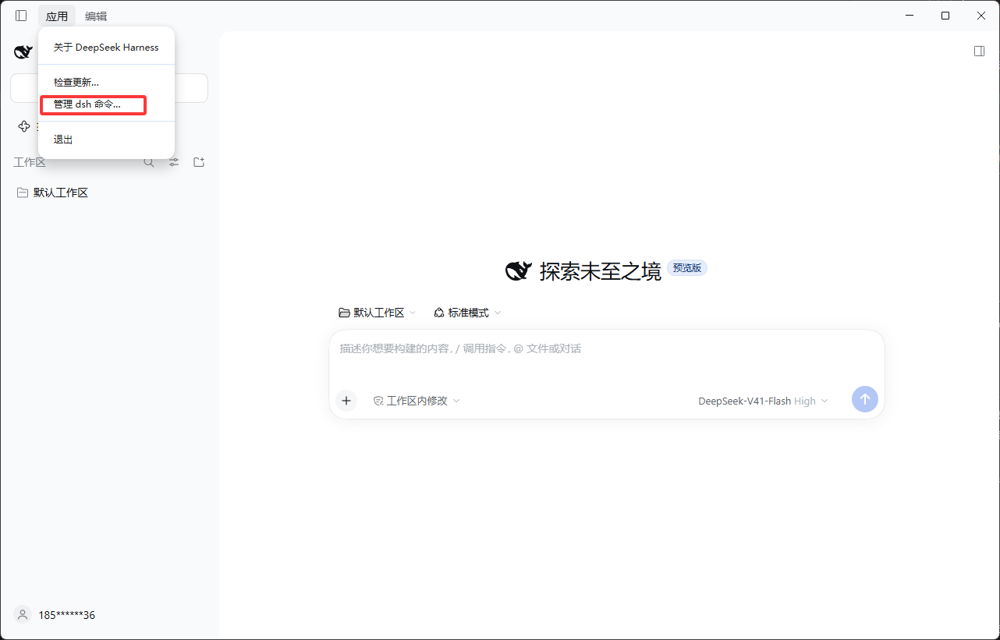

# DeepSeek Harness PC 端如何自行添加插件

## 一、告诉agent帮你装

## 二、终端命令安装

1. 先维护终端环境变量
{data-zoomable}

<!--  -->


2. 运行终端命令，示例：
```sh

dsh plugin --profile desktop add github:jiangzhenguo/dsh-codegraph

```

