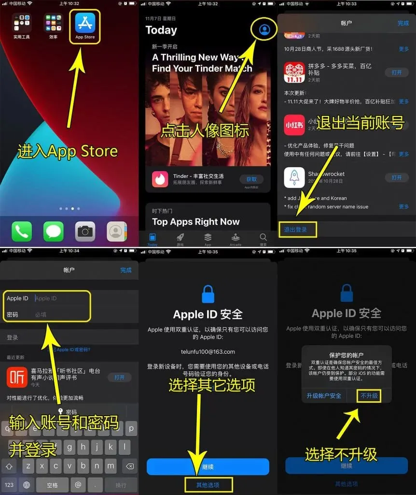

# 苹果手机注册Facebook全流程

# 准备工作

* **硬件设备**：一台 iPhone 手机 （网络使用WiFi即可）。
* **海外 Apple ID**：由网络工作人员提供，专门用于下载所需 App（下载完成后可切回自己的 ID, 此为租用, 如需购买永久单独使用可联系, 也可以[自行注册](/KnowledgeBase/AppleID美区注册.md)然后充值购买软件）。

⚠️绝对不要在设置登录，禁止登录iCloud，否则被锁机勒索，后果自负

* **代理订阅**：由工作人员提供的 **Shadowrocket** 和 **Hiddify** 的订阅地址，用于配置网络加速（两个 App 都要下载，一个主力一个备用）。
* **辅助手机号**：您本人能正常接收短信的手机号（国内 +86 号码即可），用于谷歌和 Facebook 的安全验证。
* **浏览器建议**：优先使用手机上的 **Chrome** 浏览器进行账号注册，兼容性最佳。无痕模式仅作为遇到验证问题时的备用方案。
* **电脑上访问Facebook**：手机上使用工作人员提供的电脑端网络代理程序，[教程和下载地址](/vpn/index)，安装并测试好地区节点之后，在chrome登录谷歌账号并访问https://www.facebook.com/使用既可。

# 操作流程

### 第一阶段：下载所有必需 App

1. 打开 App Store，登录工作人员提供的海外 Apple ID。
2. 搜索并下载以下 6 个 App：
   * **Shadowrocket**（主力网络工具）
   * **Hiddify Proxy & VPN**（备用网络工具，两个都要下载）
   * **Gmail**
   * **Google Authenticator**
   * **Facebook**
   * **Chrome**（若已安装可忽略）
3. 下载完成后，您可以下载其他需要的应用，然后退出海外 ID，换回自己的 Apple ID，不影响使用。

### 第二阶段：配置网络并锁定日本节点

1. 先打开 **Shadowrocket**，找到“添加订阅”或类似功能，输入工作人员提供的代理订阅地址，完成导入。
2. 再打开 **Hiddify**，同样导入相同的订阅地址（或按工作人员指示操作），作为备用。
3. 在 Shadowrocket 中选择一个**日本节点**并连接。后续若 Shadowrocket 出现异常，可随时切换到 Hiddify 连接日本节点。
4. 连接成功后，在手机浏览器中访问 `ipinfo.io`，确认页面显示的国家为 **Japan (JP)**。这一步务必确认，确保网络环境纯净。

### 第三阶段：注册谷歌账号并开启双重验证

1. 保持日本节点连接（主力用 Shadowrocket），打开 **Chrome** 浏览器，访问 `google.com`，点击“创建账号”。
2. 按提示填写姓名、生日，并自定义邮箱地址。需要验证手机号时，国家选择“中国 (+86)”，输入您的手机号完成验证。
3. 若提示“此电话号码无法用于验证”，可尝试重启注册流程，更换号码。
4. 注册成功后，立刻进行“保活”操作：打开 **Gmail App**，登录刚注册的谷歌账号，并允许通知权限。
5. **开启谷歌两步验证（非常重要）**：
   * 在 Gmail App 内点击头像 → 管理您的 Google 账号 → 安全性 → 两步验证，按提示开启。
   * 选择“身份验证器应用”，页面显示密钥后点击复制。
   * 打开 **Google Authenticator App**，点击右下角“+” → 输入设置密钥，粘贴密钥并添加（可命名为“谷歌”）。
   * 回到谷歌网页，输入验证器显示的 6 位数字，完成激活。
   * **务必截图保存页面给出的“备用验证码”**，这是找回账号的关键凭证。
6. （建议）在谷歌账户设置中，添加辅助邮箱和恢复手机号，进一步保活。

### 第四阶段：注册 Facebook 并绑定验证器

1. 确保日本节点连接正常（Shadowrocket 或 Hiddify 均可），打开 **Facebook App**。
2. 点击“创建新账号”，使用拼音填写姓名（如 San Zhang）、生日和性别。
3. 在联系方式界面，**务必选择“使用电子邮箱注册”**，填入刚注册的 Gmail 地址。
4. 设置一个 Facebook 独立登录密码。
5. 切换到 **Gmail App**，查收 Facebook 发来的 5 位验证码，填回 Facebook 完成激活。
6. **立刻绑定谷歌验证器（防封关键）**：
   * 在 Facebook 内，依次进入 设置 → 账号中心 → 密码和安全 → 双重验证。
   * 选择您的 Facebook 账号，验证方式选择“身份验证应用”。
   * 页面显示密钥后点击复制。
   * 打开 **Google Authenticator App**，点“+” → 输入设置密钥，粘贴密钥并添加（建议命名为“FB-Japan”）。
   * 回到 Facebook，输入验证器生成的 6 位数字，确认开启双重验证。

### 第五阶段：长期使用与防封守则

1. **节点锁死**：此后每次打开 Gmail 或 Facebook 前，务必先连接 Shadowrocket（或备用 Hiddify）的日本节点，切忌更换地区。
2. **Gmail 保活**：允许 Gmail App 后台刷新，不要频繁手动强退，每周至少打开一次并阅读邮件。
3. **Facebook 养号期**：注册后前 14 天为敏感期。多刷动态、点点赞，不要大量加好友、加群组、频繁换头像或群发私信。
4. **异地登录无忧**：开启双重验证后，即使因网络波动提示异地登录，只需输入 Google Authenticator 上的 6 位数字即可通过，彻底告别“短信收不到”的困境。

​

​
