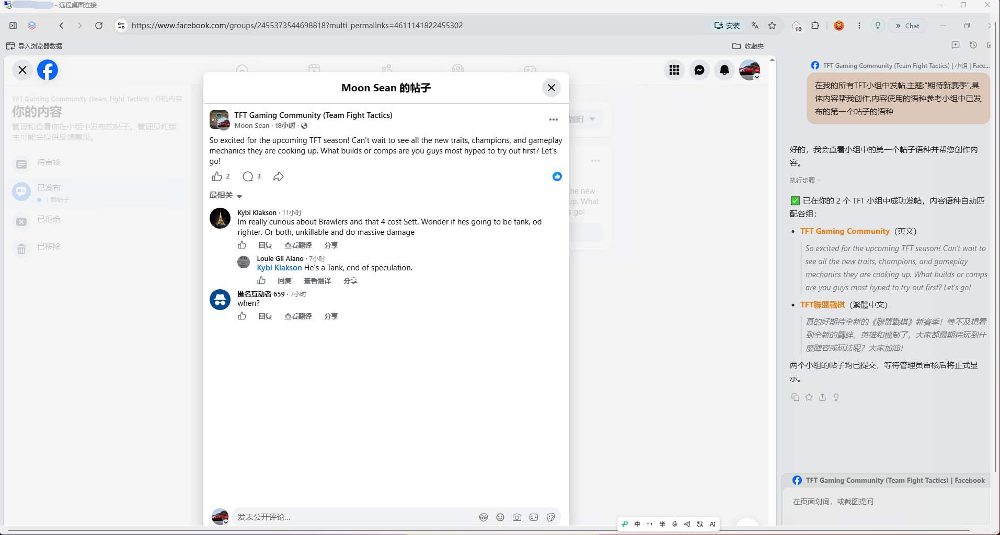
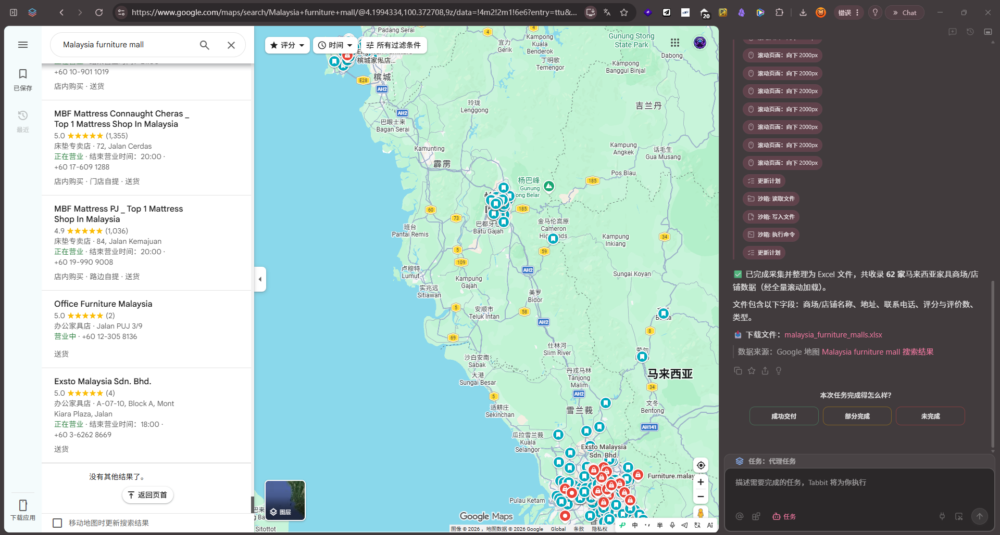
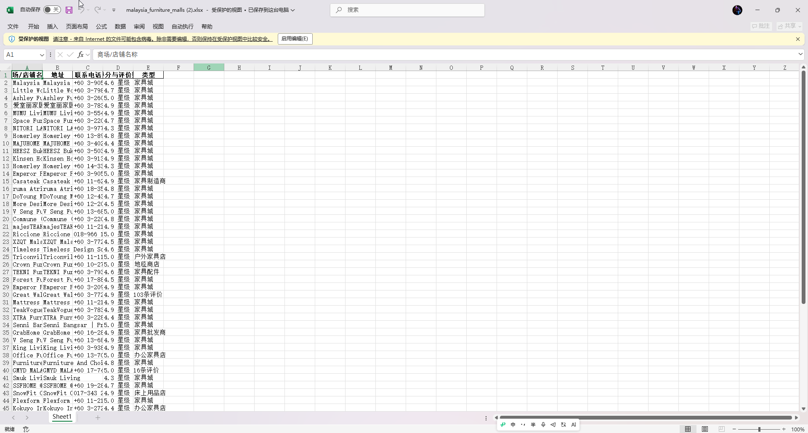

# 外贸和AI结合定制工作流
## 可以定制，欢迎老板来聊!!!!

## 输出示例
远程外贸主机定时群发帖子

• 部署在境外远程主机，设定每日/每周定时任务，自动在目标市场工作时间（如美东早9点）发布帖子至外贸论坛、社媒群组或平台动态。

• 支持多账号轮换，每条帖子可预设不同文案模板，随机组合避免重复。

• 执行后自动回传发布截图与链接，用于存档或二次分发。

{data-zoomable}
## 采集示例
关键词精准采集商业信息
• 输入产品核心词（如“industrial valve”），系统自动扩展同义词、关联词及长尾词组合。

• 基于搜索引擎（Google/Bing）及海关数据源，定向抓取公司官网、领英主页、工商注册页。

• 提取字段：公司全称、注册地址、主营产品、决策人姓名、职位、邮箱、电话、社交账号。

• 支持按地域、员工规模、年营收区间过滤，筛出高匹配度目标客户。

{data-zoomable}
{data-zoomable}

## 包括不限于

自动化邮件触达与跟进  
- 采集完成后，自动匹配对应开发信模板，并插入客户公司名、产品关联点等个性化变量。  
- 设置多轮跟进序列（如第1天发送、第3天追发、第7天补充案例），全部定时执行。  
- 跟踪打开率、点击率，标记积极互动客户，自动转入CRM待跟进列表。

多平台同步分发  
- 同一套内容可同时配置为邮件正文、LinkedIn私信、WhatsApp消息、Facebook群组帖文。  
- 根据各平台字符限制和格式要求自动适配，无需手动重写。

任务全流程可视化  
- 每个采集或发布任务生成独立进度条，显示已处理数量、成功/失败明细、失败原因（如邮箱无效、反爬）。  
- 支持断点续跑，中断后可一键继续未完成部分。

日志与数据导出  
- 所有采集结果及发送记录自动归档，可按时间段导出为CSV/Excel，便于人工复核或导入其他系统。

外贸AI主机全流程交付等

## [和我取得联系](/about/business)