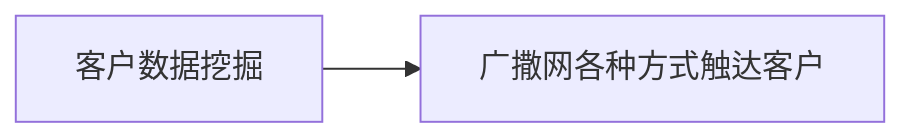
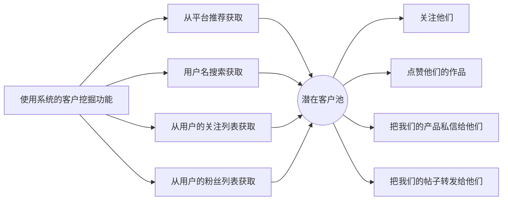
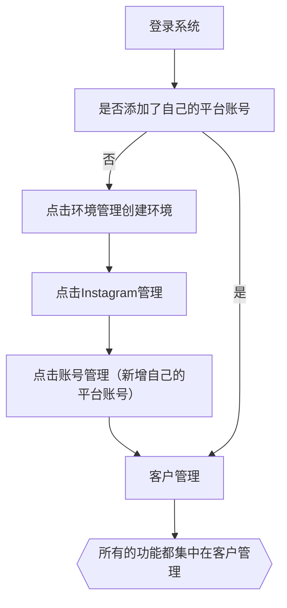

# 拓客系统使用流程

## 业务逻辑

```mermaid
graph LR
    A[客户数据挖掘] --> B[广撒网各种方式触达客户]

```

## 使用场景（举例）

### 功能的颗粒度很细，可以自行组装使用场景和业务逻辑，目前已完成 ins 平台相关逻辑

```mermaid
graph LR
    emperor((潜在客户池))
    A[使用系统的客户挖掘功能] --> B[从平台推荐获取]-->emperor
    A --> C[用户名搜索获取]-->emperor
    A --> D[从用户的关注列表获取]-->emperor
    A --> E[从用户的粉丝列表获取]-->emperor
    emperor --> H[关注他们]
    emperor --> J[点赞他们的作品]
    emperor --> K[把我们的产品私信给他们]
    emperor --> L[把我们的帖子转发给他们]
```

## 操作流程

解压安装包--》双击运行 Hws-Reptile.exe --》在打开的网页中

```mermaid
graph TD
    A[登录系统] -->q1[是否添加了自己的平台账号]
    q1 --> |否| B[点击环境管理创建环境]
    B --> C[点击Instagram管理]
    C --> D[点击账号管理（新增自己的平台账号）]
    D --> renwu[客户管理]
    q1 --> |是| renwu
    renwu --> id2{{所有的功能都集中在客户管理}}
```

