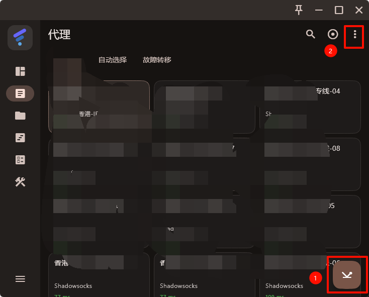
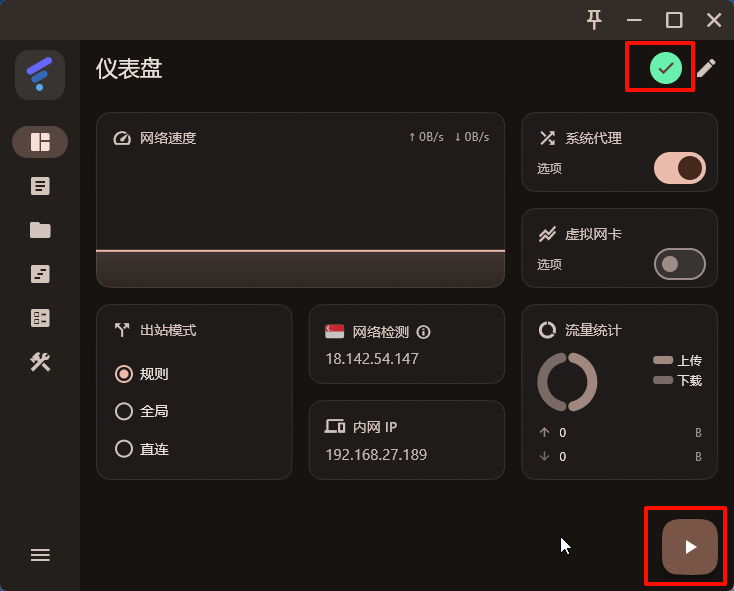

### 自助地址

- [自助下单](https://zfbvn.amusi755.com "target=_blank")

### 使用说明

<!-- <a href="https://superficial-iguanadon-bed.notion.site/ebd/283d3707e4b38099a342f86cde7970ee" target="_blank">其他系统</a> -->

<!-- <iframe src="https://superficial-iguanadon-bed.notion.site/ebd/283d3707e4b38099a342f86cde7970ee" width="100%" height="600" frameborder="0" allowfullscreen /> -->

### 使用教程及下载

#### 下载

所有下载内容在链接 [点我](https://fsw.amusi755.com/files/VN/)

##### Windows10-11安装
[FlClash-0.8.91-windows-amd64.zip]
##### M 芯片 Mac安装（如何查看什么什么芯片-点击屏幕左上角的 苹果图标-在下拉菜单中选择 “关于本机” (About This Mac)-看到一行叫 “芯片” (Chip)-显示：Apple M1 / M2 / M3 等）
[FlClash-0.8.91-macos-arm64.dmg]
##### Intel 芯片 Mac（如何查看什么什么芯片-点击屏幕左上角的 苹果图标-在下拉菜单中选择 “关于本机” (About This Mac)-看到一行叫 “芯片” (Chip)-显示：Intel Core i5 / i7 / i9 等）
[FlClash-0.8.91-macos-amd64.dmg]
##### 安卓机安装（安装提示风险解决办法自行百度，基本上都是什么安全防护都在设置里，华为系：设置，然后搜索 增强防护，关掉）
[FlClash-0.8.91-android-arm64-v8a.apk]
##### 苹果手机
使用外区账号下载 Hiddify(“Hiddify Proxy & VPN”（免费）),或者小火箭（收费），外区账号注册参照 [AppleID美区注册教程](/KnowledgeBase/AppleID美区注册.md)
##### win7安装
[mihomo-party-win7-1.8.3-ia32-portable.7z]
[mihomo-party-win7-1.8.3-x64-portable.7z]

#### 使用教程
##### 教程(手机电脑相同)

1. 导入购买的订阅地址
把订阅链接导入软件即可，找到菜单栏，点击配置，点击➕号 填写到url

2. 选择节点
代理页面可以选择一个节点，默认是自动选择的。点击"1"处按钮测速，点击"2"处按钮设置延迟排序，方便以后选择

3. 开启代理
打开首页仪表盘右上角是绿色对勾的情况下，点击右下角开关即可使用。就这么简单，关闭再点击该按钮即可。系统代理模式（接管你电脑的所有请求，比较特殊的例如Windows商店的WhatsApp就需要切换到虚拟网卡模式）。

##### 注意：

- 关机之前记得退出软件, 不然再次打开电脑可能会连不上网

##### 报错
- Windows提示缺少dll
    - 下载安装（退出上面的flclash之后，双击安装下面的补丁软件，然后重启flcalsh即可）
    - [VC_redist.x64.exe]

<!--  -->